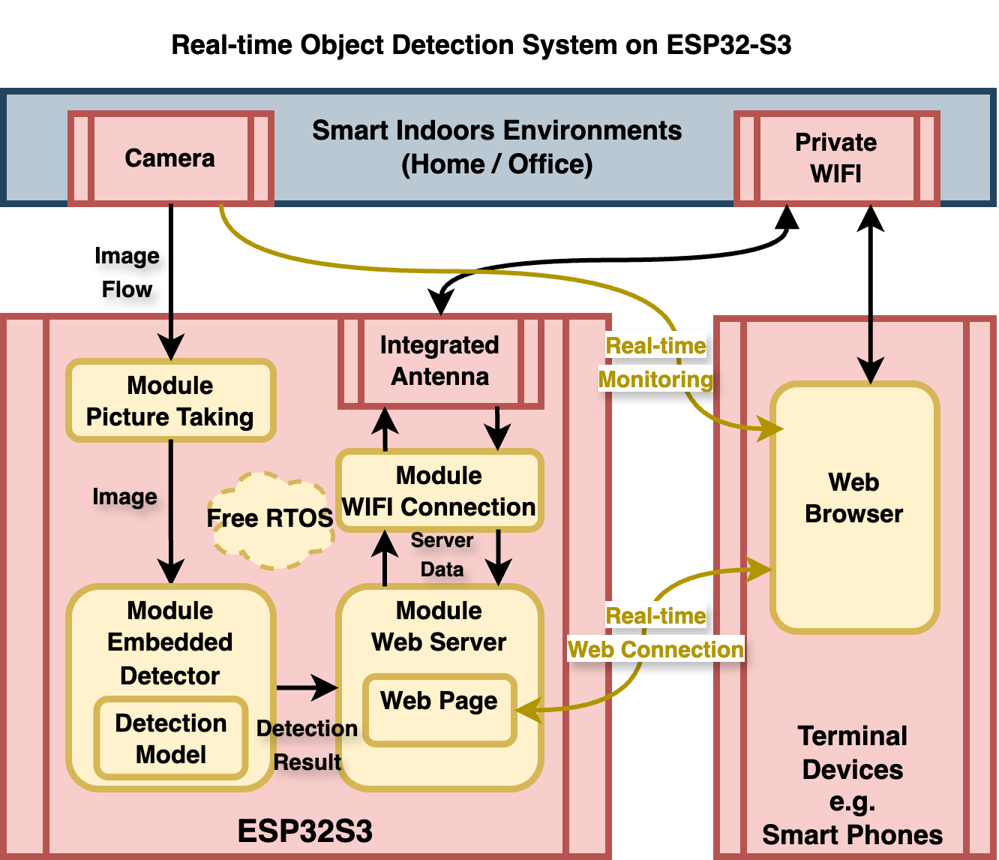
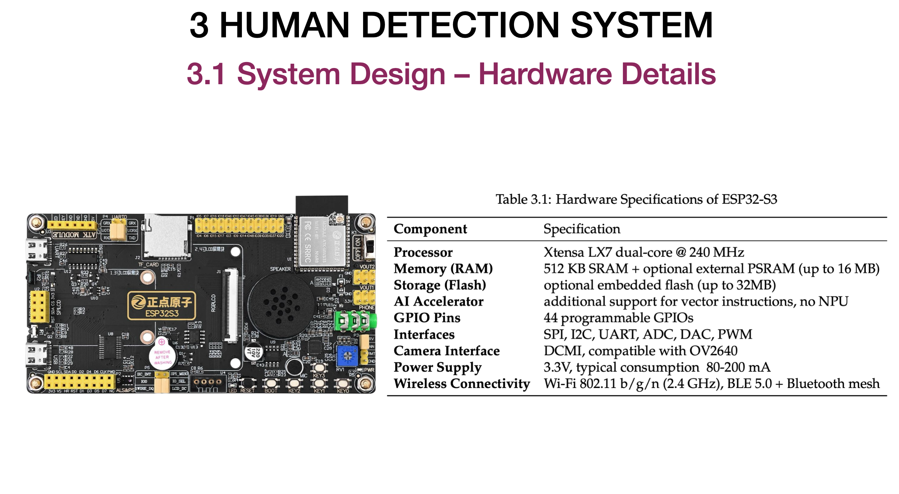
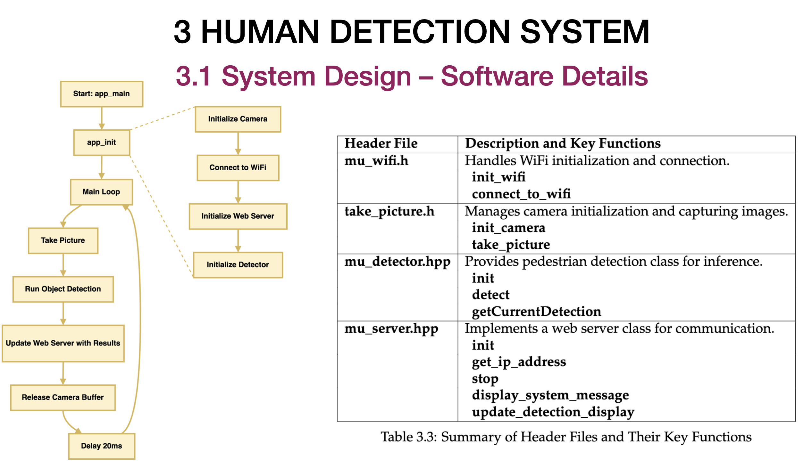
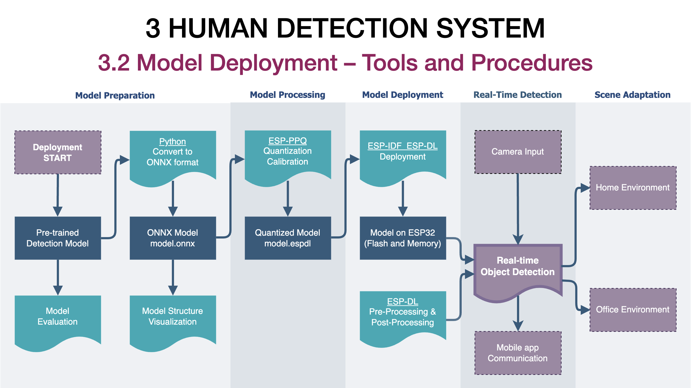
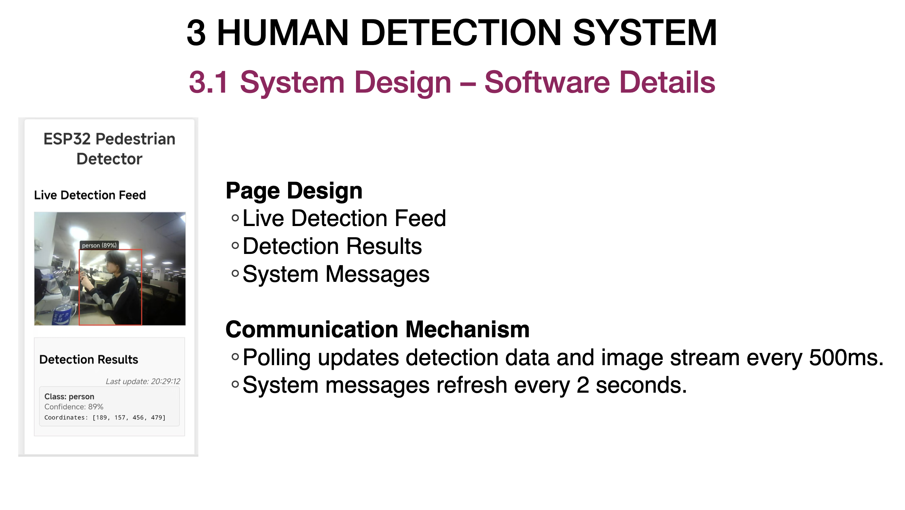
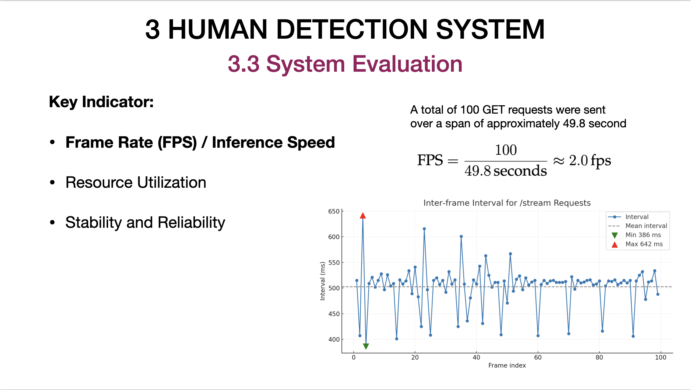
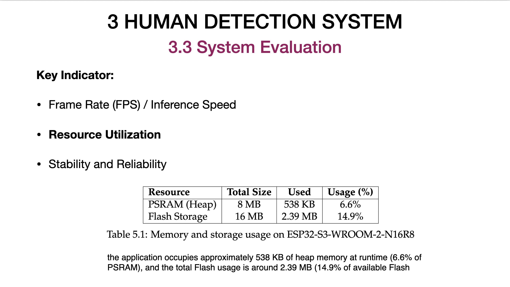
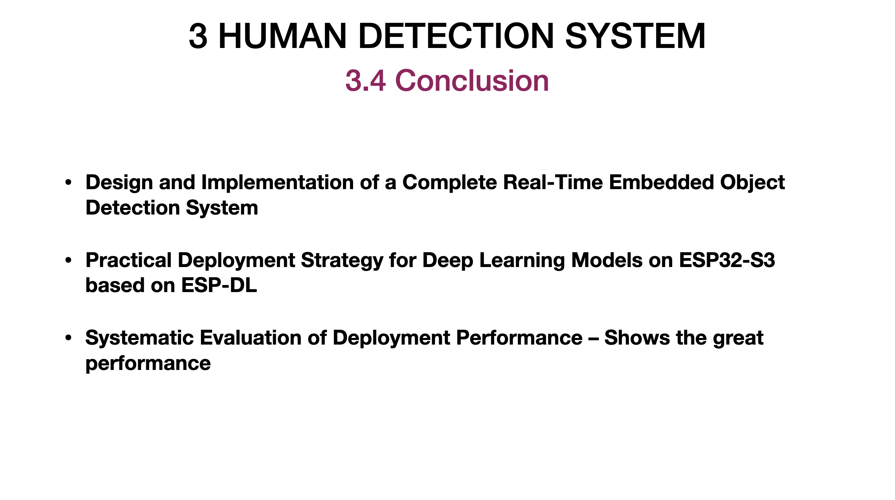

<!-- figure/conclusion.png
figure/hardware_details.png
figure/model_deployment.png
figure/page_design.png
figure/software_design.png
figure/system_design.png
figure/system_evaluation.png
figure/system_evaluation2.png
figure/system_overview.drawio.png -->

# Design, deployment, and evaluation Real-time Object Detection System on ESP32-S3

## System Overview

  

## Hardware Details

  

## Software Design

    

## Model Deployment

    

## Page Design

    

## System Evaluation

    

    

## Conclusion

    

